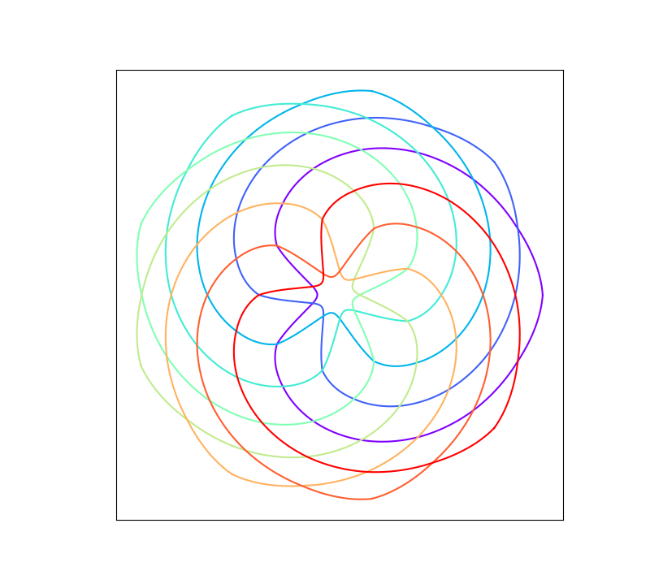

# Venn
A spin off project while making venn-diagram-like art.

This is an accidental art project that ended up making nice looking logos: [While attempting to algorithmically generate nice looking venn diagrams](https://stackoverflow.com/questions/32440128/nice-looking-five-sets-venn-diagrams/40048520) with equal areas and convex shapes (Spoiler alert: it's [impossible](https://www.r-graph-gallery.com/14-venn-diagramm.html) at higher values of N), I found these ways of generating inscribed polygons, which, when smoothened and nicely coloured, looks quites aesthetically pleasing.
